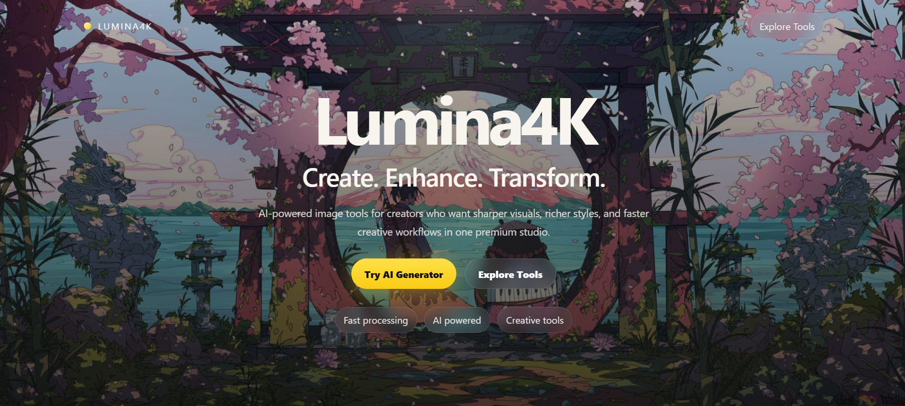
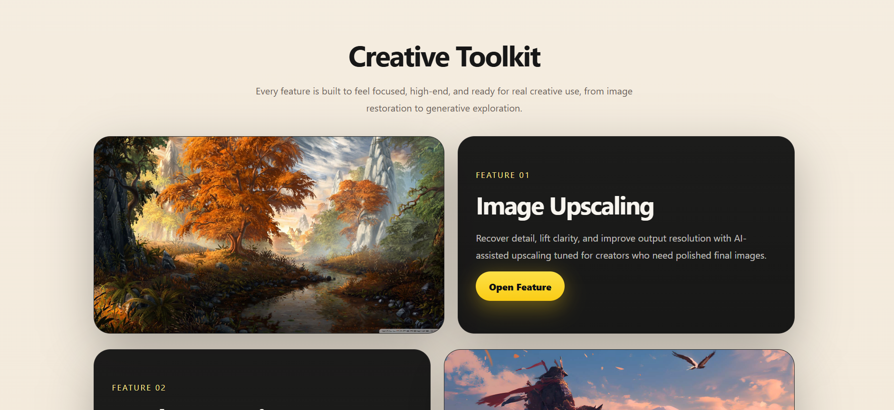
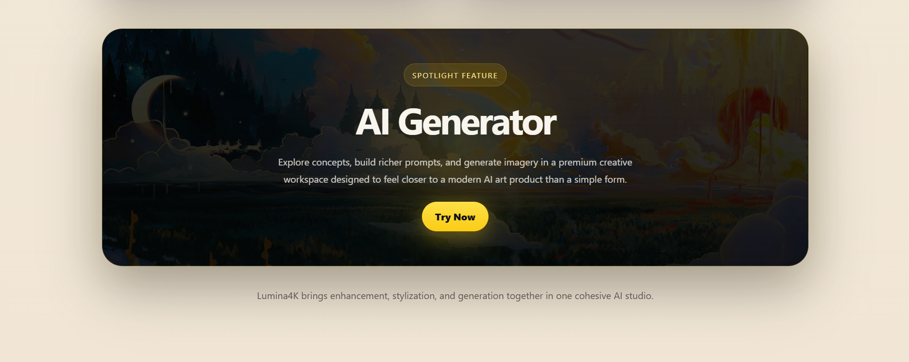

# 🚀 Lumina4K — AI Image Enhancement Suite



Lumina4K is a full-stack AI-powered image processing platform that combines enhancement, stylization, and generation into one cohesive creative studio.

---

## ✨ Overview



Lumina4K is designed for creators who want:

* Sharper visuals
* Faster workflows
* AI-powered transformations

It brings multiple computer vision capabilities into a clean, modern web interface.

---

## 🔥 Features

### 🔍 Image Upscaling

Enhance resolution using AI-based super-resolution (RealESRGAN).
Recover details and improve clarity for low-quality images.

---

### ⚡ Batch Processing

Process multiple images at once with automated upscaling.
Download results as a ZIP file.

---

### 🎨 Filter Studio

Apply classic filters with real-time preview:

* Grayscale
* Sepia
* Invert
* Blur
* Sharpen
* Brightness / Contrast / Saturation

---

### 🖌️ Style Fusion

Apply neural style transfer to images:

* Mosaic
* Candy
* Rain Princess
* Udnie

Adjust style strength and preview instantly.

---

### 🤖 AI Generator



Generate images using text prompts with AI.
Supports:

* Text-to-image
* Image-to-image
* Creative prompt-based generation

---

## 🧠 Tech Stack

* **Backend:** Flask
* **Frontend:** HTML, CSS, JavaScript
* **Deep Learning:** PyTorch
* **Computer Vision:** OpenCV, PIL
* **Models:** RealESRGAN, Neural Style Transfer, Stable Diffusion (API)

---

## 📂 Project Structure

```
Lumina4K/
│
├── app.py
├── core/
├── templates/
├── static/
├── assets/screenshots/
├── models/
├── uploads/
├── outputs/
└── requirements.txt
```

---

## ⚙️ Setup Instructions

### 1. Clone the repository

```
git clone https://github.com/your-username/Lumina4K.git
cd Lumina4K
```

---

### 2. Create environment

```
conda create -n lumina python=3.10
conda activate lumina
```

---

### 3. Install dependencies

```
pip install -r requirements.txt
```

---

### 4. Add model weights

Place required `.pth` files in:

```
/models/
```

---

### 5. Set API key (for AI Generator)

```
set REPLICATE_API_TOKEN=your_api_key
```

---

### 6. Run the app

```
python app.py
```

---

## 🌐 Usage

Open in browser:

```
http://127.0.0.1:5000
```

---

## 🧹 File Management

* Uploaded and processed files are temporary
* Auto-cleanup prevents storage overflow

---

## 🚧 Future Improvements

* Real-time batch progress tracking
* In-memory processing (no disk storage)
* Advanced AI filters
* Cloud deployment

---

## 📌 Highlights

* Full-stack AI + Web project
* Multiple integrated ML features
* Clean UI/UX design
* Modular and scalable architecture

---

## 👨‍💻 Author

Developed by Kumar Aditya Raj

---

## ⭐ Support

If you like this project, give it a star ⭐ on GitHub!
